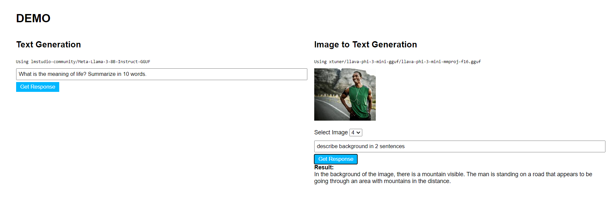

# Local LLM Node App

This is a concise guide for setting up and running a demonstration Node.js application that utilizes Local Large Language Models (LLMs) through the LM Studio command-line interface.

## Prerequisites
1. Create an `.env` file in the root directory with your OpenAI key in the following format:
   ```
   OPEN_API_KEY="<<YOUR OPEN AI KEY GOES HERE AS STRING>>"
   ```

2. Ensure you have the LM Studio CLI installed and the LMS server running. For detailed instructions, refer to the [LM Studio SDK Quick Start Guide](https://lmstudio.ai/docs/lmstudio-sdk/quick-start#set-up-lm-studio-cli-lms).

## Models Used
For the sake of simplicity in this demo app, we've used the following models:

1. **Text Generation Model**:
   - Model: `lmstudio-community/Meta-Llama-3-8B-Instruct-GGUF/Meta-Llama-3-8B-Instruct-IQ3_M.gguf`
   - Installation tutorial: [YouTube Tutorial](https://www.youtube.com/watch?v=KtSdNwVkpWc)

2. **Vision Model**:
   - Model: `xtuner/llava-phi-3-mini-gguf/llava-phi-3-mini-int4.gguf`
   - Installation tutorial: [YouTube Tutorial](https://www.youtube.com/watch?v=HYfsuxRXb34)
   - Note: You don't need a paid subscription of OpenAI to use a local model.

## How to Run the App
1. Install dependencies:
   ```
   npm install
   ```

2. Start the LMS server:
   ```
   lms server start
   ```

3. Run the Node.js app:
   ```
   npm start
   ```

## Description of Model Usage
- GPU offload is disabled in `handlers.js`. For faster machines, you can adjust this setting using the following parameters: `number`, `"auto"`, `"max"`, or `"off"`.
- The vision model used in this DEMO uses OpenAI Client format. Refer to the [OpenAI Vision Guide](https://platform.openai.com/docs/guides/vision) for details.
  > Prior to utilizing the vision model, it is essential to first load the model in **LM Studio** and configure the gpu_offload setting according to your machine in the LM Studio user interface.
- In below code API endpoint exposed by LMS is `http://localhost:1234/v1`, and the `OPEN_API_KEY` is defined in your `.env` file. 
```
const client = new OpenAI({ baseURL: "http://localhost:1234/v1", apiKey: process.env.OPEN_API_KEY });
```

## Screenshots

**Models Used**    

     
**App Interface**    

     
**Response of Text Model**    

    
**Response of Vision Model**     

    
**Vision Setting in LM Studio**    

